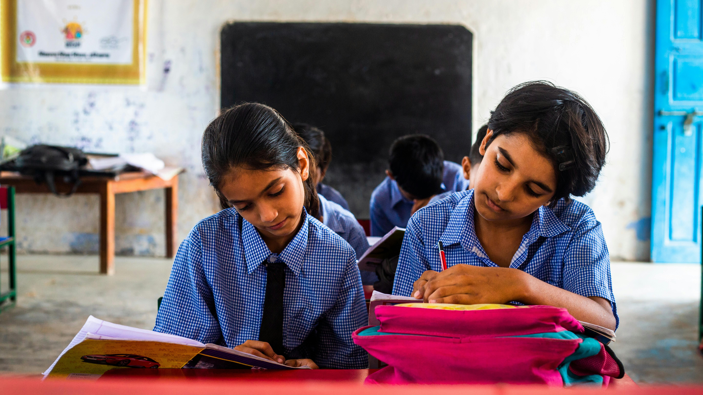

# Image Download Guide for Pathways Website

## Instructions
1. Click on each Unsplash link below
2. Click the download button (↓) on the Unsplash page
3. Save the image with the suggested filename
4. Place it in the `/pathways-website/images/` folder

## Images to Download

### 1. Hero Section (index.html)
**Location:** Line 106
**Current:** `<div class="image-placeholder">`
**Download from:** https://unsplash.com/photos/children-sitting-on-chairs-inside-classroom-3ckWUnaCxzc
**Save as:** `hero-children-learning.jpg`
**Replace with:**
```html

```

### 2. Project Image 1 (index.html)
**Location:** Line 124
**Download from:** https://unsplash.com/photos/books-on-brown-wooden-shelf-bL5iMSXf4Ss
**Save as:** `project-library.jpg`
**Replace with:**
```html

```

### 3. Project Image 2 (index.html)
**Location:** Line 142
**Download from:** https://unsplash.com/photos/person-using-macbook-pro-on-table-OgvqXGL7XO4
**Save as:** `project-digital-learning.jpg`
**Replace with:**
```html

```

### 4. Project Image 3 (index.html)
**Location:** Line 160
**Download from:** https://unsplash.com/photos/brown-concrete-building-during-daytime-L-sm1B4L1Ns
**Save as:** `project-infrastructure.jpg`
**Replace with:**
```html

```

### 5. Library Program (projects.html)
**Location:** Line 59
**Download from:** https://unsplash.com/photos/girl-in-pink-and-white-crew-neck-shirt-reading-book-lEKkPDHU9TA
**Save as:** `library-program-detail.jpg`
**Replace with:**
```html

```

### 6. Digital Learning (projects.html)
**Location:** Line 95
**Download from:** https://unsplash.com/photos/macbook-pro-on-brown-wooden-table-376KN_ISplE
**Save as:** `digital-learning-detail.jpg`
**Replace with:**
```html

```

### 7. Infrastructure (projects.html)
**Location:** Line 131
**Download from:** https://unsplash.com/photos/brown-and-white-concrete-building-under-blue-sky-during-daytime-i7XSuN4xv1Y
**Save as:** `infrastructure-detail.jpg`
**Replace with:**
```html

```

### 8. Completed Project 1 (projects.html)
**Location:** Line 176
**Suggestion:** Use existing image
**Replace with:**
```html

```

### 9. Completed Project 2 (projects.html)
**Location:** Line 201
**Suggestion:** Use existing image
**Replace with:**
```html

```

### 10. Completed Project 3 (projects.html)
**Location:** Line 226
**Suggestion:** Use existing image
**Replace with:**
```html

```

### 11. Impact School Image 1 (impact.html)
**Location:** Line 114
**Suggestion:** Use existing image
**Replace with:**
```html

```

### 12. Impact School Image 2 (impact.html)
**Location:** Line 139
**Suggestion:** Use existing image
**Replace with:**
```html

```

## Alternative: Use Existing Images
You already have excellent images of Raja Rajeshwari school. Consider using these for all placeholders instead of downloading new ones, as they're authentic photos of your actual work.

## Quick Terminal Commands (After Manual Download)

After downloading the 7 images from Unsplash and placing them in the images folder, you can verify with:

```bash
cd /Users/gana/dev/projects/swasth/dbt-coach-app/ai-upgrade-new/pathways-website/images
ls -la *.jpg
```

## License Information
All Unsplash images are free to use under the Unsplash License:
- Free for commercial and non-commercial use
- No permission needed
- Attribution appreciated but not required
